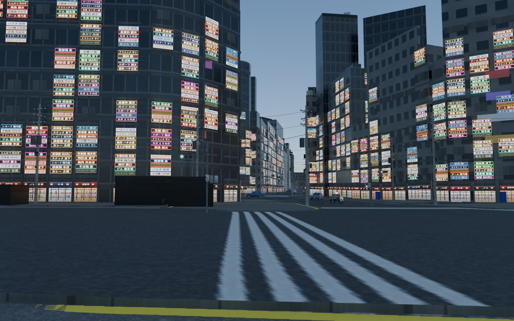
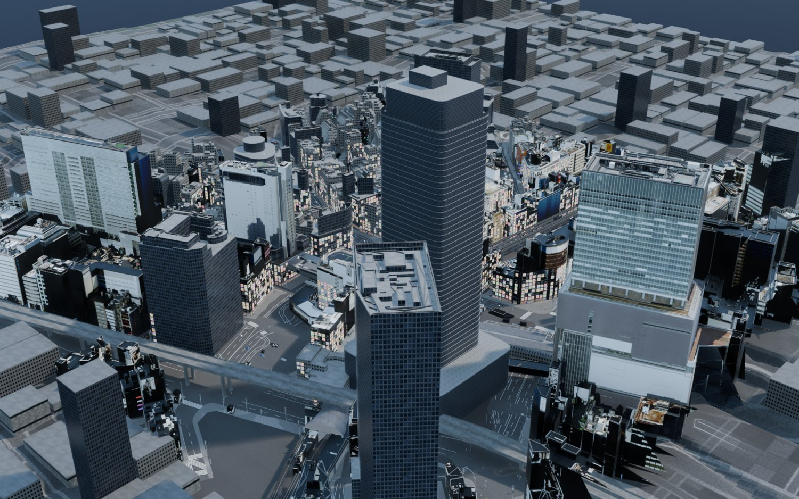
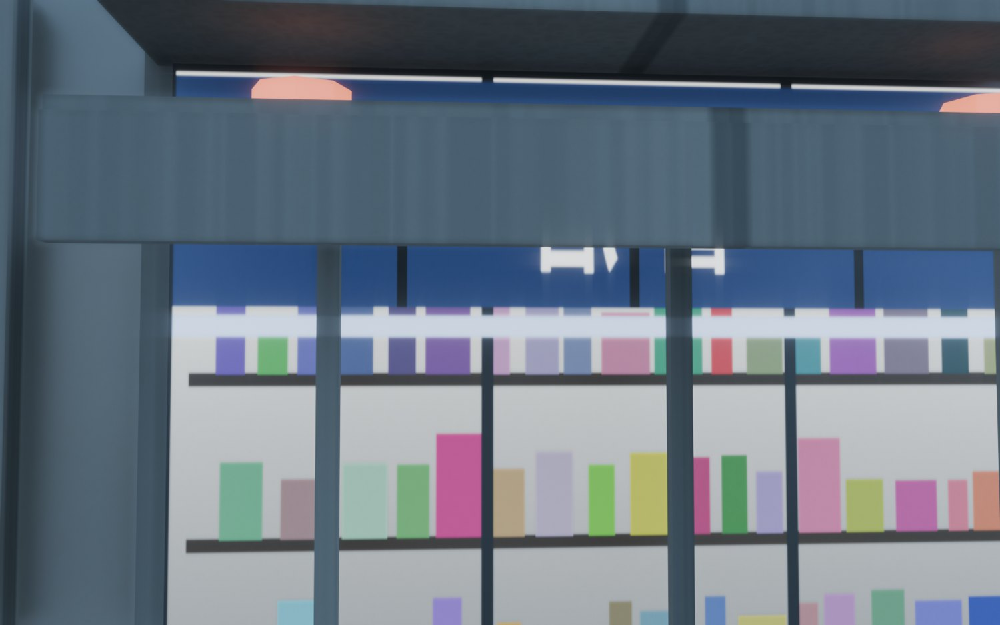

# Shibuya Asset Pack

도쿄 시부야역 일대를 **실제 GIS 데이터**로 지은 맵과, 거기서 뽑아낸 게임 에셋 팩.
손으로 배치하지 않았다 — 건물·도로 배치는 좌표계에서 나온다.



| | |
|---|---|
|  |  |

## 데이터 출처와 좌표 레시피

재유도할 필요 없이 그대로 쓸 수 있게 실측값을 남긴다.

| 항목 | 값 |
|---|---|
| 건물 | **PLATEAU LOD2** (東京23区). OBJ를 쓸 것 — FBX 쌍둥이는 동일 지오메트리에 3.61 GB다 |
| 다운로드 단위 | 2차 메시 `533935`. 시부야역 커버 타일 `53393585 / 53393586 / 53393595 / 53393596` |
| 도로 | PLATEAU **`tran` (TrafficArea)**. 기능 코드 1000 차도부 / 1020 교차부 / 2000 보도부 / 3000 섬 |
| 좌표계 | **EPSG:6677** (JGD2011 평면직각 **9계**). 이미 East/North/Up → `forward_axis='Y', up_axis='Z', global_scale=1.0` |
| 앵커 | 스크램블 교차로 `35.6594821, 139.7005723` → 9계 `E −12020.273, N −37770.556` |
| 지형 고도 | 실제 9.1 – 35.5 m (시부야 = 계곡). 평탄화하지 말 것 |

**PLATEAU에는 도로 중심선이 없고, 교차부가 하나의 측량된 폴리곤으로 들어있다.** 그래서 OSM 중심선을
압출해 도로를 만들던 v1(리본이 교차점마다 겹치고 UV가 없어 텍스처가 깨짐)을 버리고,
도로를 **지오메트리가 아니라 지면 텍스처의 픽셀**로 굽는 방식으로 갈아탔다. 8192² / 정확히
0.078125 m/px. 차선·횡단보도만 OSM에서 합성해 차도 마스크에 스텐실한다.

### 검증된 함정

- `mesh.transform()` 직후 `o.bound_box`는 낡은 값이다. `o.data.vertices`로 확인할 것.
- 원점에서 38 km 떨어진 좌표를 `object.location`으로 옮기면 float32 오차가 남는다. 메시에 구울 것.
- 카메라 `clip_end` 기본값 1000 m — 1225 m 밖 오버뷰가 도시를 통째로 far-clip 한다.
- DEM `.mtl`이 zip에 없는 텍스처를 참조해서 **마젠타로 렌더**된다. 평범한 지면 머티리얼로 교체.
- `mesh.separate(LOOSE)`는 모든 머티리얼 슬롯을 자식마다 복제한다 → 451,263 슬롯.
  `material_slot_remove_unused`로는 부족하고, 실제 쓰인 인덱스만 남겨 수동 리맵해야 한다 (→ 1,223 슬롯).
- LOD2인데 이 타일들은 **Z가 전부 0.0**이다. 고가도로 판별은 `Road function == '5'`(도시고속도로)로 할 것.

## 구성

```
exports/     GLB 71개 (Git LFS) — 자판기, 신호기, 가로수, 전주, 케이블, 보도블록, 군중 등
previews/    에셋 프리뷰 + 맵 렌더
docs/        카테고리, 실측 매니페스트, 기각 기록
scripts/     배치·아틀라스·감사 스크립트 37종
ATTRIBUTION.md
```

## 라이선스

- **PLATEAU** 도시 데이터: CC BY 4.0 (国土交通省)
- **OpenStreetMap** 도로/차선: **ODbL 1.0** — OSM에서 파생한 데이터에는 동일조건 변경허락이 붙는다.
  이 리포의 지면 베이크는 OSM 파생물을 포함하므로 재배포 시 ODbL 조건을 확인할 것.
- Sketchfab 임포트 에셋: 각각 **CC-BY 4.0**. 저작자·UID는 [`ATTRIBUTION.md`](ATTRIBUTION.md).
- 직접 만든 모델과 스크립트: CC BY 4.0 / MIT.
